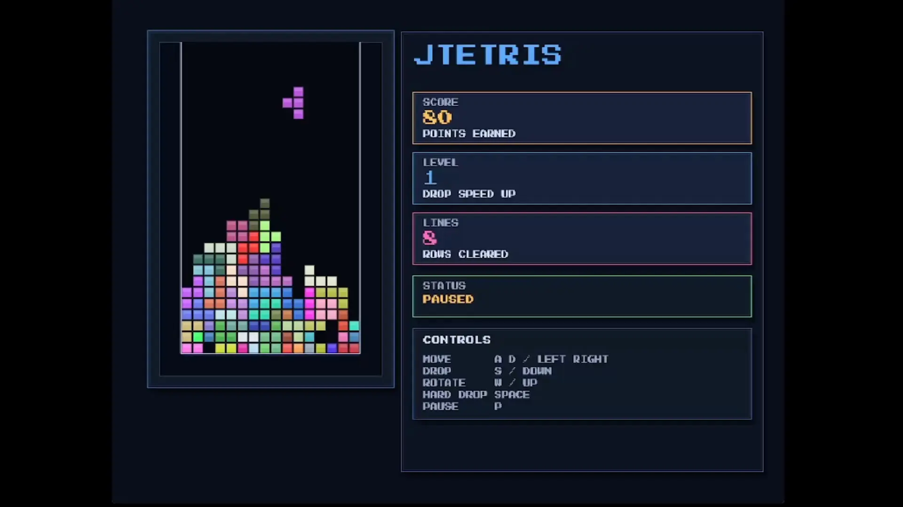

# JTetris

[](https://www.codacy.com/gh/paussu/JTetris/dashboard?utm_source=github.com&amp;utm_medium=referral&amp;utm_content=paussu/JTetris&amp;utm_campaign=Badge_Grade)

JTetris is a desktop Tetris clone written in C++ with SDL2, SDL_ttf, OpenGL, GLEW, and Nuklear.

The project focuses on a simple arcade-style Tetris experience with a menu, configurable resolution, retro-inspired HUD, and a modern CMake + vcpkg workflow on Windows.

## Showcase



## Features

- Playable Tetris gameplay loop
- Main menu built with Nuklear
- Resolution selection before starting the game
- Score, level, and cleared line tracking
- Pause and help toggle support
- Retro HUD styling and bordered playfield
- CMake project with vcpkg-managed dependencies

## Tech stack

- C++20
- CMake
- SDL2
- SDL2_ttf
- SDL2_image
- OpenGL
- GLEW
- Nuklear
- vcpkg

## Getting started

### Requirements

- Windows
- Visual Studio 2022 with C++ tools
- CMake 3.21 or newer
- vcpkg installed at `C:/vcpkg` or available through the `VCPKG_ROOT` environment variable

### Install dependencies

Dependencies are declared in `vcpkg.json` and are installed automatically during CMake configure when using the provided preset.

### Configure

```powershell
cmake --preset windows-vs2022-debug
```

### Build

```powershell
cmake --build --preset windows-vs2022-debug
```

### Run

The executable is generated in the build output directory:

```text
build/Debug/JTetris.exe
```

Runtime DLLs and assets are copied automatically after build.

## Controls

| Action | Keys |
|---|---|
| Move left | `A` / Left Arrow |
| Move right | `D` / Right Arrow |
| Soft drop | `S` / Down Arrow |
| Rotate | `W` / Up Arrow |
| Hard drop | `Space` |
| Start | `Enter` |
| Pause | `P` |
| Quit | `Esc` |

## Project structure

```text
JTetris/
├─ Assets/          # Fonts and images
├─ include/         # Public headers
├─ src/             # Game and menu implementation
├─ nuklear/         # Nuklear single-header UI integration
├─ cmake/           # Helper CMake scripts
├─ CMakeLists.txt   # Main build configuration
├─ CMakePresets.json
└─ vcpkg.json       # Dependency manifest
```

## Build notes

- The project uses CMake presets for Windows and Visual Studio 2022.
- vcpkg manifest mode is used to install and resolve external packages.
- Post-build steps copy assets and required runtime DLLs next to the executable.

## Assets

- Font: [Press Start 2P](https://fonts.google.com/specimen/Press+Start+2P)

## Future improvements

- Next-piece preview
- Audio and music
- Better game-over and restart flow
- Hold piece support
- Cross-platform presets

## License

This repository includes a `LICENSE` file at the project root.
