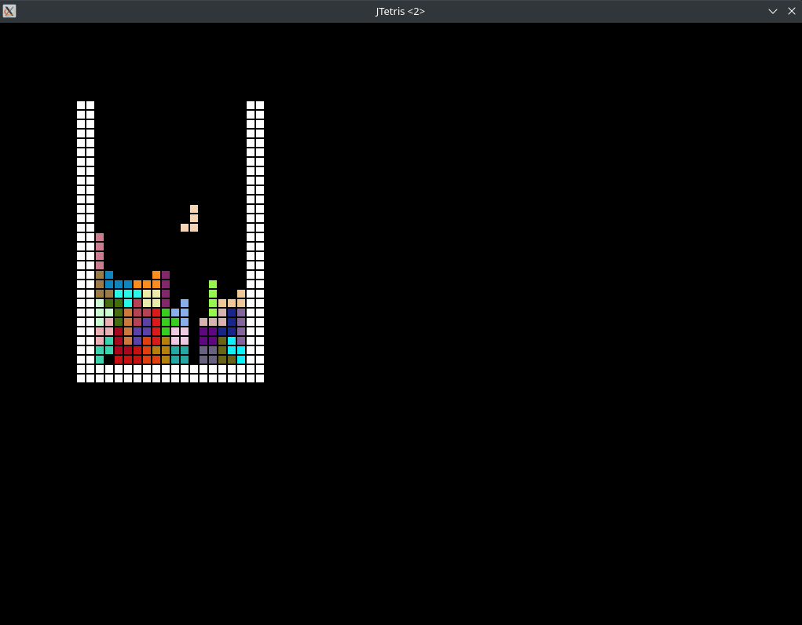

# JTetris

Trying to create a Tetris game with C++ and Rust.

First C++ and then Rust.

Implementations will be in separate branches.

### Screenshot

### Assets

Font: https://fonts.google.com/specimen/Press+Start+2P
